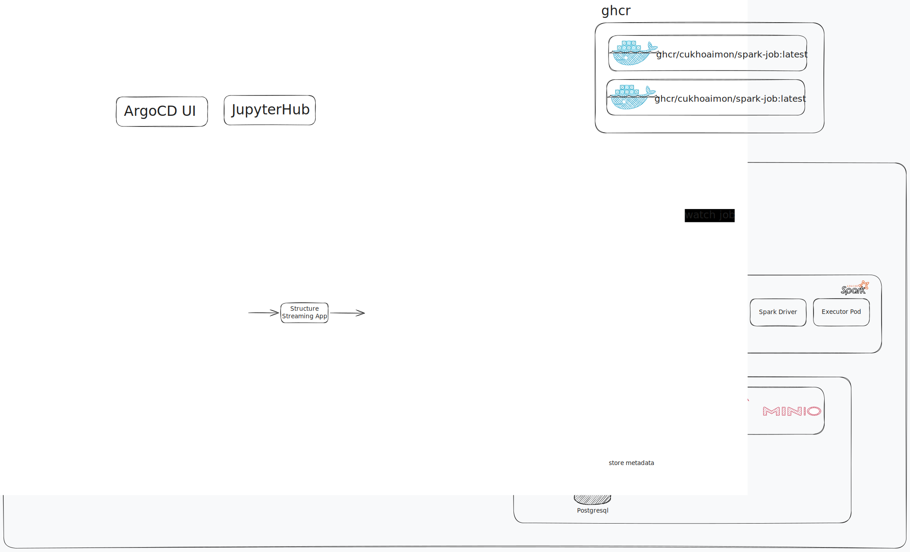

# devoops - DevOps Learning Repo

## Overview

This repository is a **GitOps learning project** using **ArgoCD** on a local **OrbStack** Kubernetes cluster. It demonstrates a full modern data engineering stack, from ingestion to processing to querying.

Changes pushed to the `main` branch of `github.com/cukhoaimon/devoops-argocd` are automatically synced to the cluster via ArgoCD.

---

## Architecture



All components are deployed as **Helm charts**, each with a corresponding ArgoCD `Application` manifest under `argocd/`.

```
argocd/               # ArgoCD Application manifests + apply-all.sh bootstrap script
hbase/                # HBase (ZooKeeper + Master + RegionServer StatefulSets)
iceberg/              # Iceberg REST Catalog (REST server + SQLite metadata PVC)
jupyter/              # JupyterLab (pyspark-notebook + Spark Connect ingress)
kafka/                # Apache Kafka (message broker)
kafka-ui/             # Kafka UI (web dashboard for Kafka)
minio/                # MinIO via AiStor Operator (S3-compatible object storage)
satellite-simulator/  # Satellite telemetry simulator (produces Kafka events)
satellite-stream/     # Spark Structured Streaming job (consumes Kafka → Iceberg)
spark/                # Spark on K8s (driver/executor setup + custom ghcr.io image)
spark-jobs/           # Batch Spark jobs (SparkApplication CRDs via spark-operator)
spark-operator/       # Spark Operator (manages SparkApplication CRDs)
apps/                 # JupyterLab notebooks and Spark job source code
docker-compose.yaml   # Local test stack: MinIO + Iceberg REST + Spark
Dockerfile            # nginx:alpine static site (my-web)
docs/                 # Weekly learning notes per milestone
```

### Namespace Assignments

| Component          | Namespace       |
|--------------------|-----------------|
| hbase              | non-prod        |
| minio              | data-warehouse  |
| iceberg            | data-warehouse  |
| spark              | spark           |
| spark-operator     | spark           |
| spark-jobs         | spark           |
| jupyter            | spark           |
| kafka              | kafka           |
| kafka-ui           | kafka           |
| satellite-simulator| satellite       |

### Data Stack Integration

```
Satellite Simulator ──► Kafka (topic: telemetry)
                              │
                    Spark Structured Streaming (satellite-stream)
                              │
                    Iceberg REST Catalog ──► MinIO (S3 API, NodePort 31000) — data files
                                       ──► SQLite PVC                      — catalog metadata

JupyterLab (jupyter.local) ──► Spark Connect (port 15002) ──► Iceberg REST ──► MinIO
Spark Batch Jobs            ──► Iceberg REST ──► MinIO
```

---

## Quick Start

### 1. Install ArgoCD

```bash
kubectl create namespace argocd
kubectl apply -n argocd -f https://raw.githubusercontent.com/argoproj/argo-cd/stable/manifests/install.yaml

# Get admin password
kubectl -n argocd get secret argocd-initial-admin-secret -o jsonpath="{.data.password}" | base64 -d

# Port-forward UI
kubectl port-forward svc/argocd-server -n argocd 8080:443
```

### 2. Bootstrap All ArgoCD Applications

```bash
# Apply all applications at once (first-time only — after this, GitOps takes over)
bash argocd/apply-all.sh

# Or apply individually:
kubectl apply -f argocd/minio-application.yaml
kubectl apply -f argocd/iceberg-application.yaml
kubectl apply -f argocd/spark-operator-application.yaml
kubectl apply -f argocd/spark-application.yaml
kubectl apply -f argocd/spark-jobs-application.yaml
kubectl apply -f argocd/jupyter-application.yaml
kubectl apply -f argocd/kafka-application.yaml
kubectl apply -f argocd/kafka-ui-application.yaml
kubectl apply -f argocd/satellite-simulator-application.yaml
kubectl apply -f argocd/hbase-application.yaml
```

### 3. Configure Local DNS (Ingress)

OrbStack exposes ingress via `127.0.0.1`:

```bash
echo "127.0.0.1 jupyter.local" | sudo tee -a /etc/hosts
```

---

## Development

### Build & Push the Custom Spark Image

```bash
./spark/docker/build-and-push.sh [optional-tag]
```

The image is pushed to `ghcr.io` and referenced by the Spark Helm chart and SparkApplication jobs.

### Local Testing (Docker Compose)

Spin up MinIO + Iceberg REST + Spark locally without Kubernetes:

```bash
docker compose up
```

### Helm Dry-Run / Template Preview

```bash
helm template <release-name> ./<chart-dir>
helm install <release-name> ./<chart-dir> --dry-run
```

---

## Important Patterns

- **OrbStack local images**: The K8s cluster shares the host Docker daemon — no `eval $(minikube docker-env)` needed. Build normally and set `pullPolicy: Never` in values.
- **ArgoCD requires remote Git**: push to GitHub before expecting sync — ArgoCD cannot read the local filesystem.
- **Sealed Secrets**: credentials are encrypted with `kubeseal` and committed as `SealedSecret` manifests. They can only be decrypted by the controller in the original cluster. Back up the controller's master key.
- **MinIO path-style access**: set `CATALOG_S3_PATH__STYLE__ACCESS: "true"` — MinIO does not support virtual-hosted style.
- **`AWS_REGION`**: must be set even when using MinIO (the AWS SDK requires it regardless).
- **`CreateNamespace=true`** in `syncOptions` lets ArgoCD auto-create namespaces on first sync.
- **imagePullSecrets**: private images from `ghcr.io` require a Kubernetes secret created from a GitHub PAT and referenced in chart values.
