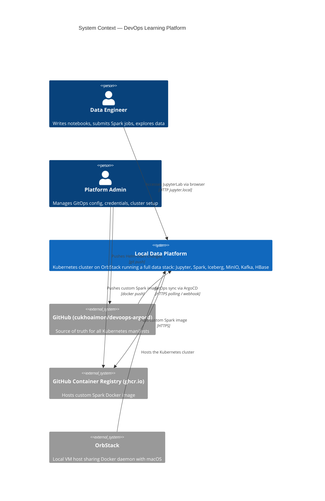
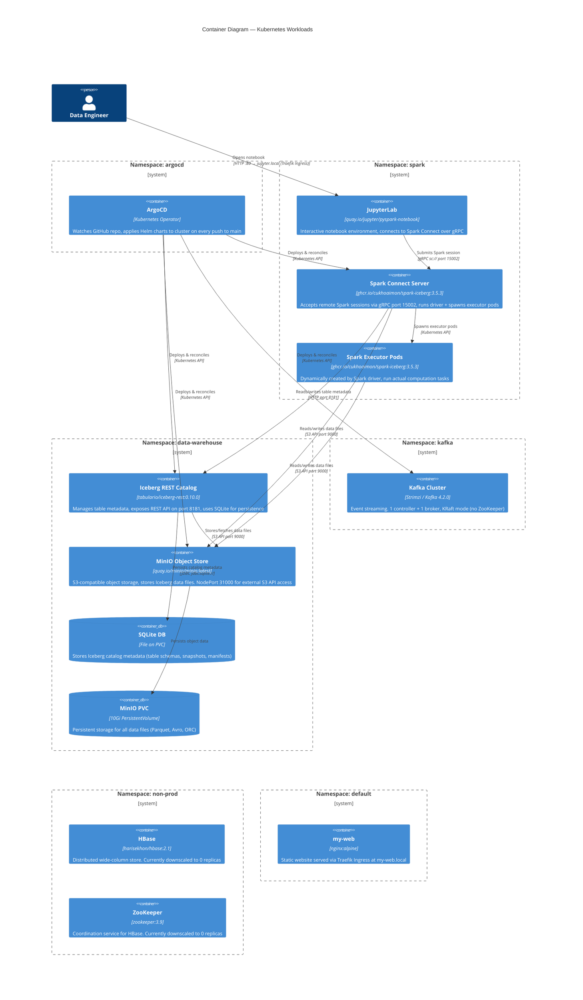
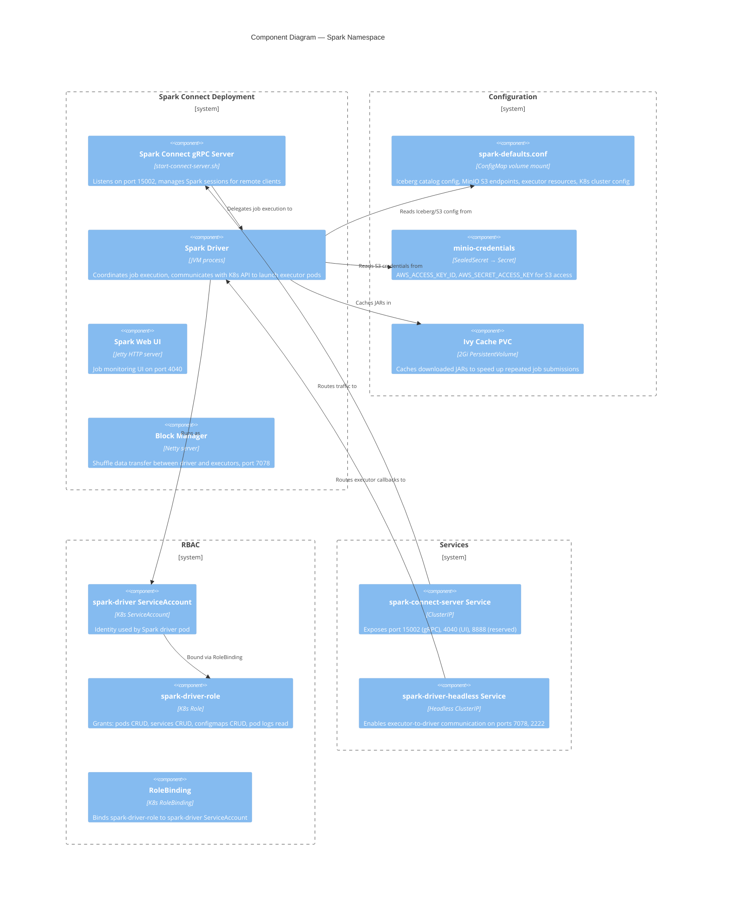
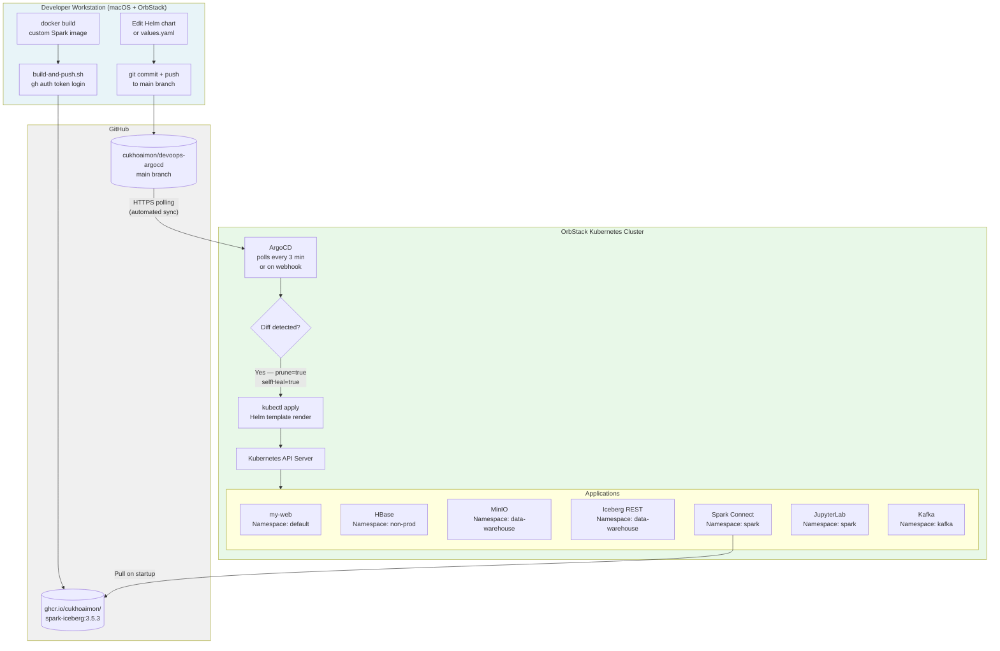
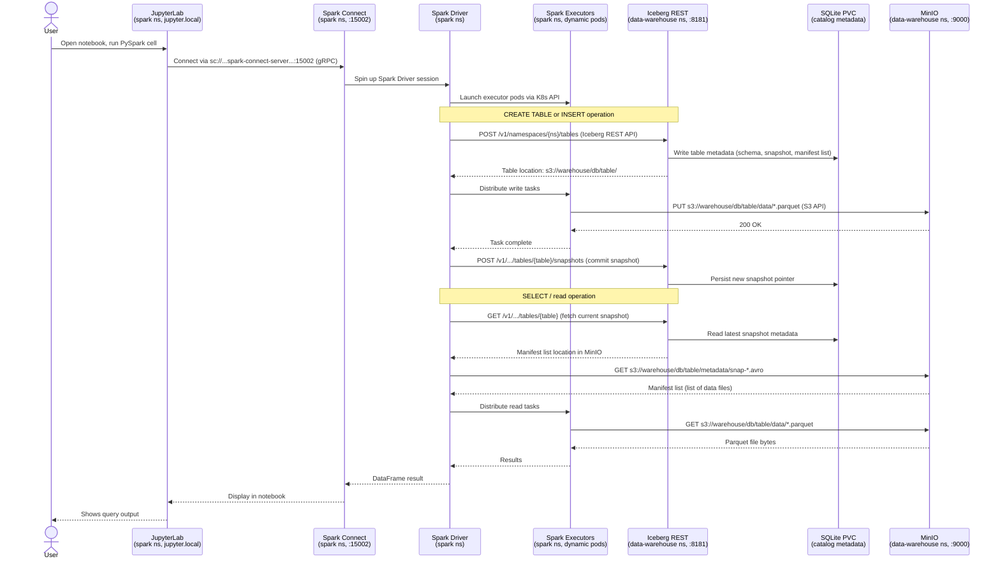
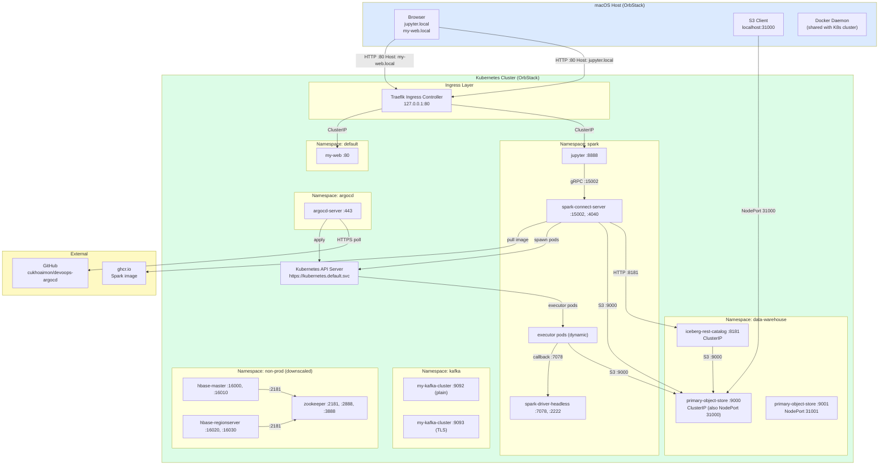
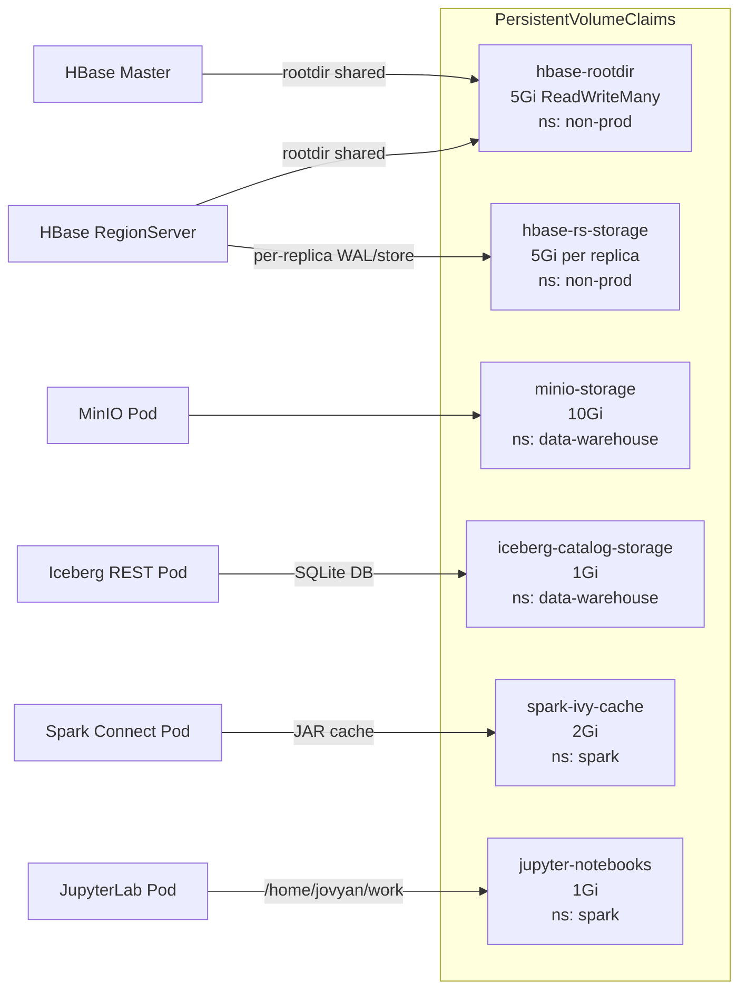
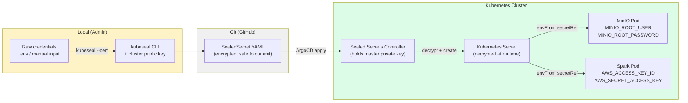

# Architecture Overview

A GitOps-driven local Kubernetes data platform on OrbStack. Changes pushed to GitHub are automatically synced to the cluster via ArgoCD.

---

## C4 Level 1 — System Context

---

## C4 Level 2 — Containers

---

## C4 Level 3 — Spark Component Detail

---

## GitOps Flow

---

## Data Flow — Jupyter → Spark → Iceberg → MinIO

---

## Network Topology

---

## Persistent Storage Map

---

## Secrets & Credentials Flow

---

## Component Summary Table

| Component | Image | Namespace | Replicas | Ports | Storage | Access |
|-----------|-------|-----------|----------|-------|---------|--------|
| **ArgoCD** | argoproj/argocd | argocd | 1 | 443 | — | kubectl port-forward :8080 |
| **my-web** | nginx:alpine | default | 1 | 80 | — | `my-web.local` (Ingress) |
| **ZooKeeper** | zookeeper:3.9 | non-prod | **0** (down) | 2181/2888/3888 | emptyDir | Internal only |
| **HBase Master** | harisekhon/hbase:2.1 | non-prod | **0** (down) | 16000/16010 | Shared 5Gi PVC | Internal only |
| **HBase RegionServer** | harisekhon/hbase:2.1 | non-prod | **0** (down) | 16020/16030 | 5Gi per replica | Internal only |
| **MinIO** | quay.io/minio/minio | data-warehouse | 1 | 9000/9001 | 10Gi PVC | NodePort 31000/31001 |
| **Iceberg REST** | tabulario/iceberg-rest:0.10.0 | data-warehouse | 1 | 8181 | 1Gi PVC (SQLite) | ClusterIP only |
| **Spark Connect** | ghcr.io/cukhoaimon/spark-iceberg:3.5.3 | spark | 1 | 15002/4040/7078 | 2Gi Ivy cache | ClusterIP only |
| **Spark Executors** | ghcr.io/cukhoaimon/spark-iceberg:3.5.3 | spark | 2 (dynamic) | — | — | Internal only |
| **JupyterLab** | quay.io/jupyter/pyspark-notebook | spark | 1 | 8888 | 1Gi PVC | `jupyter.local` (Ingress) |
| **Kafka Controller** | Strimzi / Kafka 4.2.0 | kafka | 1 | — | 100Gi PVC | Internal only |
| **Kafka Broker** | Strimzi / Kafka 4.2.0 | kafka | 1 | 9092/9093 | 100Gi PVC | Internal only |
